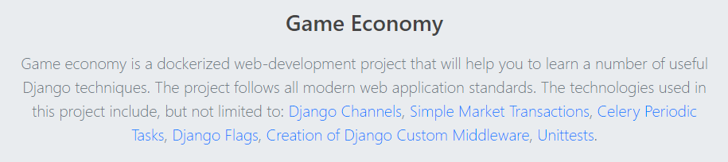

<h1> Installation </h1>
<ul>

<li>1. From the development folder create an .env file: 
		<code> cp .env_template .env </code>  
		    Populate the .env file with your sensitive variables. This file is included in the .gitignore and your variables will not be accessible to anyone else.
	  
</li>
<li>2. Build and start the project: 
		<code>docker-compose up -d —build</code>
</li>
<li>3. If you want to check the status of the running containers, run: 
		<code>docker ps</code>  
		Celery beat container is going to keep restarting until you set up the database as it is shown in the next bulletpoint.
</li>
<li>4. Here are the instructions for the initial project setup as well as the database setup. 
  Log in into uwsgi container: 
        <code>docker-compose exec uwsgi bash</code> 
        In uwsgi container: 
            <code>python manage.py collectstatic</code> 
            <code>python manage.py migrate</code> 
            <code>python manage.py shell</code> 
            In the python shell (you can substitute 'root' to any other name/password you like): 
                              <code> from users.models import Profile; from django.contrib.auth.models import User </code> 
                              <code> Profile.objects.create(user=User.objects.create_superuser(username="root", password="root"), subdomain="root")</code>
</li></ul>
